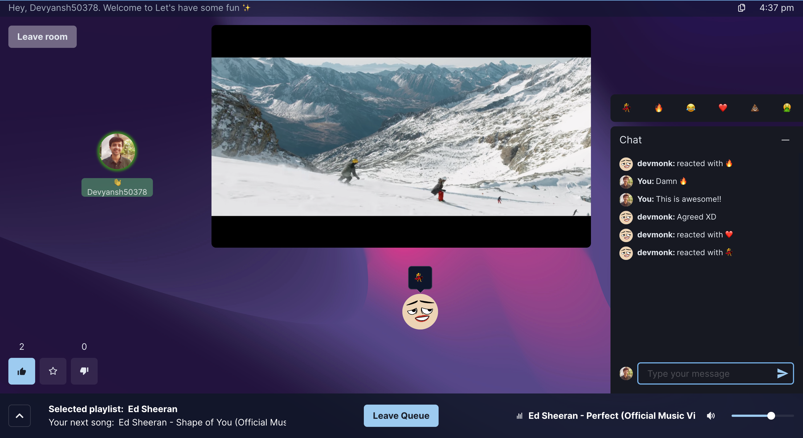
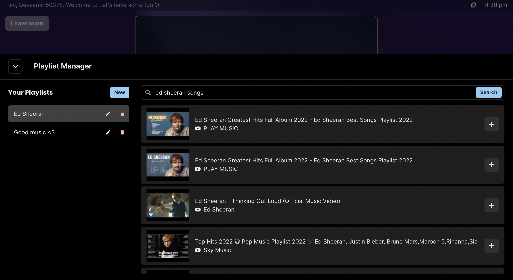

# GrooWe


## ⚡ Main Features

* Listen to the same songs with your buddies simultaneously.
* Interact through instant messaging, proximity audio, reactions and voting.
* A fair queue mechanism which ensures everyone's song choices gets played.
* Smooth user interface.

## 👨‍💻 Tech Stack

- Frontend: React.js, Chakra UI, Redux, Socket.io Client, Axios
- Backend: Node.js, Express.js, Redis (node-redis), Socket.io

## ⚙️ How it works

GrooWe is based on the monolithic architecture. The client communicates with the `Express.js` server through HTTP requests and `Socket.io` events. The server communicate with the YouTube API to allow users to search Youtube for songs and the Redis database to handle storing & retrieving data and searching for rooms. The Redis Adapter relies on Redis Pub/Sub mechanism which ensures horizontal scaling by adding multiple instances of the server and database.

An overview of the application core constructs is given below:

### Rooms 

Users can create rooms where others can join. A room is a place where multiple people can listen to the same songs together, at the same time. Creation of a room emits a `Socket.io` event that generates new room details on the server/database which are send back to the client. Public rooms can then be searched and joined.

Join public rooms:


Create a room:


Listen to songs in the room:



### Queue Mechanism

Users can join the queue in the room to have the songs in their selected playlist played. The order in which users join the queue determines the order on which songs are played. For each user in the queue, the first song in their selected playlist will be played. Then the first song will be cycled to the back of the playlist. This way, each user in the queue is guaranteed to have one of their songs played and playlists of any size will continue to keep playing until the user leaves the queue.

Friends in queue:


The queue mechanism is handled through `Socket.io` events. Events will be emitted when the song plays, or when there are no more users in the queue (as to stop the song).

### Playlists

A playlist is a collection of songs. Songs are played through playlists created by users. Users can freely add or remove songs from their playlists and rearrange the order of their songs. Playlists help facilitate the queue mechanism of GrooWe.



### Voting

Users can like or dislike the current song. This is also handled through `Socket.io` events. If at least half of the people in the room have disliked the song, it will be skipped.

## 📦 How the data is stored

- User
    - Prefix: `user:`
    - Type: `json`
    - Data: Stores information of the logged in user.
    - Properties:
        - username
        - password
        - profilePicture
        - playlist
        - selectedPlaylist
    - Commands:
    <br /><br />
    > #### To create a new user or update user data:
    > JSON.SET user:\${username} \${path} \${jsonObject}
    >
    > #### To get user data:
    > JSON.GET user:\${username} \${path}
    
- Session
    - Prefix: `sess:`
    - Type: `string`
    - Data: Stores session data for authentication.
    - Commands:
    <br /><br />
    > #### To reate a new session:
    > SET sess:\${sessionId} \${data}
    >
    > #### To get session data:
    > GET sess:\${sessionId}
    >
    > #### To check if session exists:
    > EXISTS sess:\${sessionId}

- Room
    - Prefix: `room:`
    - Type: `hash`
    - Properties:
        - messages
        - id
        - json
        - numMembers
        - description
        - name
        - private
        - genres
    - Indices (RediSearch):
        - name: `TEXT`
        - description: `TEXT`
        - genres: `TAG`
        - numMembers: `NUMERIC`
        - private: `TAG`
    - Commands:
    <br /><br />
    > #### To get JSON representation of this room:
    > HGET \${roomId} json
    >
    > #### To reate a new room or update room (not all fields required): 
    > HSET room:\${roomId} id \${roomId} name \${name} description \${description} private \${private} genres \${genres} numMembers \${numMembers} json \${roomJson}
    >
    > #### To Check if a room exists (used when attempting to join room):
    > EXISTS \${roomId}
    >
    > #### To search rooms on room page:
    > FT.SEARCH \@name|description:(\${searchQuery}) \@private:{false} \@genres:{\${genres}} SORTBY numMembers DESC LIMIT \${offset} \${limit}

- Socket
    - Prefix: `socket:`
    - Type: `string`
    - Data: The username that this socket belongs to.
    - Commands:
    <br /><br />
    > #### To create a new socket:
    > SET socket:\${socketId} \${username}
    >
    > #### To get username associated with socket:
    > GET socket:\${socketId}
    >
    > #### To delete socket:
    > DEL socket:\${socketId}

- User queue
    - Prefix: `queue:`
    - Type: `list`
    - Data: A list of usernames of users in the queue of the associated room.
    - Commands:
    <br /><br />
    > #### To add user to queue or create queue:
    > RPUSH queue:\${roomId} \${username}
    >
    > #### To get all users in the queue:
    > LRANGE queue:\${roomId} 0 -1
    >
    > #### To remove user from queue:
    > LREM queue:\${roomId} -1 \${username}
    >
    > #### To cycle through queue (move user from front of queue to back of queue):
    > LPOP queue:\${roomId} *followed by*
    > RPUSH queue:\${roomId} \${username}

- Messages
    - Prefix: `message:`
    - Type: `list`
    - Data: JSON-stringified objects, with fields `id`, `timeSent`, `text`, `sender` (which contains fields `username` and `profilePicture`).
    - Commands:
    <br /><br />
    > #### To add a new message to the room's message history:
    > LPUSH message:\${messagesId} \${data}
    >
    > #### To get message history of a room, starting with the newest and going backwards:
    > LRANGE message:\${messagesId} \${start} \${end}

## 📥 How to run it locally?

### Prerequisites:
- Node v14.17.6
- npm v8.1.3
- Redis v6.2.5 with RedisJSON v1.0 and RediSearch v2.0 

I used the [redislab/rejson](https://hub.docker.com/r/redislabs/rejson/) and [redislab/redisearch](https://hub.docker.com/r/redislabs/redisearch/) Docker images to setup Redis modules.


1. In the root directory of **frontend**, type: `npm install` to install dependencies.
2. In the root directory of **backend**, create a `.env` file with the following contents:
```dosini
REDIS_HOST=localhost    
REDIS_PASSWORD=your_password_for_redis
REDIS_PORT=redis_port
SALT_ROUNDS=10
SESSION_SECRET=your_session_secret
YOUTUBE_KEY=your_youtube_api_key
```
|Property|Description|
|---|---|
|REDIS_HOST|URL of where your Redis is hosted|
|REDIS_PASSWORD|Password to your Redis|
|REDIS_PORT|Port where Redis instance is hosted|
|SALT_ROUNDS|Number of salt rounds for bcrypt|
|SESSION_SECRET|Secret for session cookies to authenticate users |
|YOUTUBE_KEY|Your YouTube API key|
3. In the root directory of **backend**, type: `npm install` to install dependencies.
4. Run `npm start` in root directory of **backend.**
5. Run `npm start` in root directory of **frontend.**
6. Your app should be running at localhost:3000.
