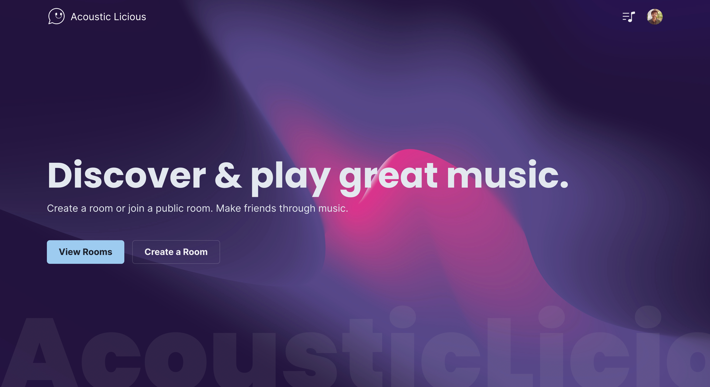
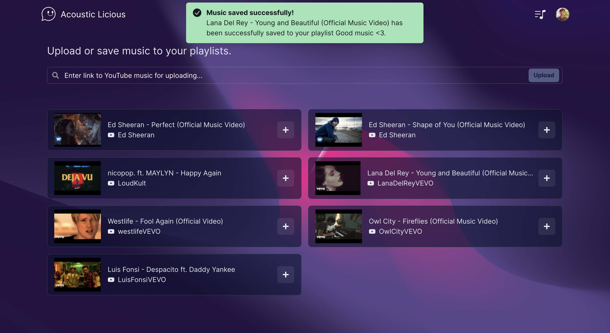

# Acoustic Licious

COVID-19 has significantly impacted the mental health of children and adults alike. Globally, the population suffering from loneliness rose from 6% to 21% post-pandemic; with communication going more virtual, better ways of socializing need to be developed. 

Introducing **Acoustic Licious,** a stunning new way to discover & play great music and make new friends.

<p align="center">

</p>

## ⚡ Main Features

* Listen to the same songs with your buddies simultaneously.
* Interact through instant messaging, proximity audio, reactions, and voting.
* Share your favorite music with others by uploading it to Solana blockchain and saving their music to your playlist.
* A fair-queue mechanism that ensures everyone's song choices get played.
* A beautiful user interface that is pleasing to the eye.

## 👨‍💻 Tech Stack

- Frontend: React.js, Chakra UI, Redux, Socket.io Client, Solana Web3 Client, Anchor
- Backend: Node.js, Express.js, Redis, Socket.io, Rust, Anchor

<p align="center">


</p>

## ⚙️ How it works

Acoustic Licious is based on the monolithic architecture. The client communicates with either `Solana` to store & fetch soundtracks or an `Express.js` server through HTTP requests and `Socket.io` events. The server communicate with the YouTube API to allow users to search Youtube for songs and the Redis database to handle storing & retrieving data and searching for rooms. The Redis Adapter relies on Redis Pub/Sub mechanism which ensures horizontal scaling by adding multiple instances of the server and database.

An overview of the application core constructs is given below:

### Rooms 

Users can create public or private rooms where others can join. A room is a place where multiple people can listen to the same songs together at the same time. Public rooms can be searched and joined, whereas the invite link of the room has to be shared with others for joining private rooms.

Join public rooms:

<p align="center">

</p>


Listen to songs in the room:

<p align="center">

</p>

### Playlists

A playlist is a collection of songs. Songs are played through playlists created by users. Users can freely add or remove songs from their playlists and rearrange the order of their songs inside the room. There are following two ways to search and add music to playlists:

- **Solana Music:** Users can add their favorite music to Solana blockchain for others to add them. Similarly, users can add songs uploaded by you to their playlists.

<p align="center">

</p>

<p align="center">

</p>

- **Through YouTube:** A user can add music to their playlist by searching them on YouTube.

<p align="center">

</p>

### Queue Mechanism

Users can join the queue in the room to have the songs in their selected playlist played. The order in which users join the queue determines the order in which songs are played. The first song in their selected playlist will be played for each user in the queue. Then the first song will be cycled to the back of the playlist. Each user in the queue is, thus, guaranteed to have one of their songs played, and playlists of any size will continue to keep playing until the user leaves the queue.

### Voting

Users can like or dislike the current song. If at least half of the people in the room have disliked the music, it will be skipped.

## 📥 How to run it locally?

### Prerequisites:
- Node v14.17.6
- npm v8.1.3
- Redis v6.2.5 with RedisJSON v1.0 and RediSearch v2.0 

I used the [redislab/rejson](https://hub.docker.com/r/redislabs/rejson/) and [redislab/redisearch](https://hub.docker.com/r/redislabs/redisearch/) Docker images to setup Redis modules.

1. Run the above Docker images.
2. In the root directory of **backend**, create a `.env` file with the following contents:
```dosini
REDIS_HOST=localhost    
REDIS_PASSWORD=your_password_for_redis
REDIS_PORT=redis_port
SALT_ROUNDS=10
SESSION_SECRET=your_session_secret
YOUTUBE_KEY=your_youtube_api_key
GOOGLE_CLIENT_ID=your_google_client_id
GOOGLE_CLIENT_SECRET=your_google_client_secret
```
|Property|Description|
|---|---|
|REDIS_HOST|URL of where your Redis is hosted|
|REDIS_PASSWORD|Password to your Redis|
|REDIS_PORT|Port where Redis instance is hosted|
|SALT_ROUNDS|Number of salt rounds for bcrypt|
|SESSION_SECRET|Secret for session cookies to authenticate users |
|YOUTUBE_KEY|Your YouTube API key|
|GOOGLE_CLIENT_ID|Google Client ID in your GCP project|
|GOOGLE_CLIENT_SECRET|Google Client secret in your GCP project|
3. In the root directory of **backend**, type: `npm install` to install dependencies.
4. Run `npm start` in root directory of **backend.**
5. In the root directory of **frontend**, type: `npm install` to install dependencies.
6. Run `npm start` in root directory of **frontend.**
7. Your app should be running at localhost:3000 ✨